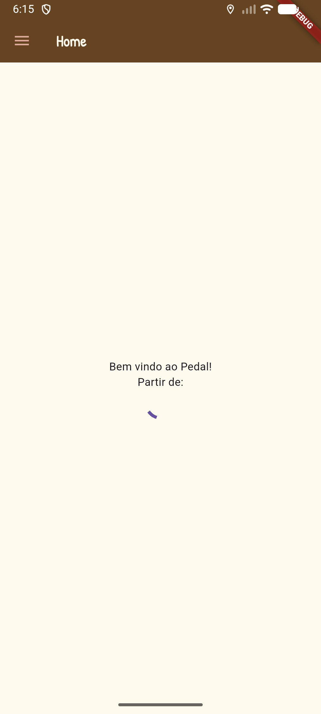
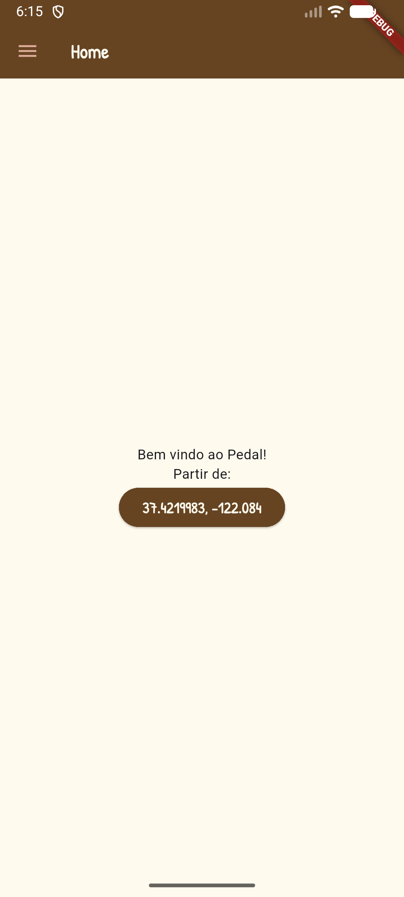
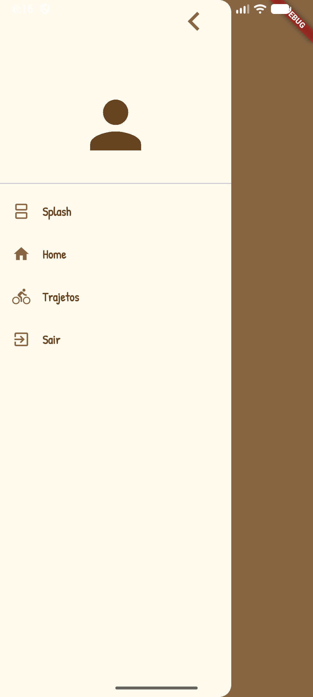
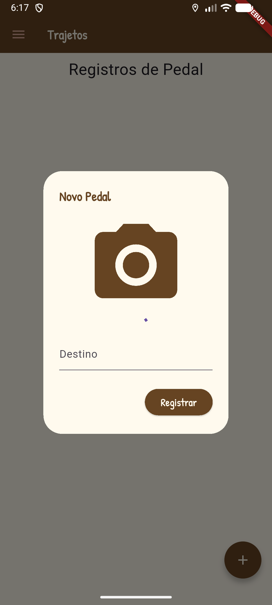
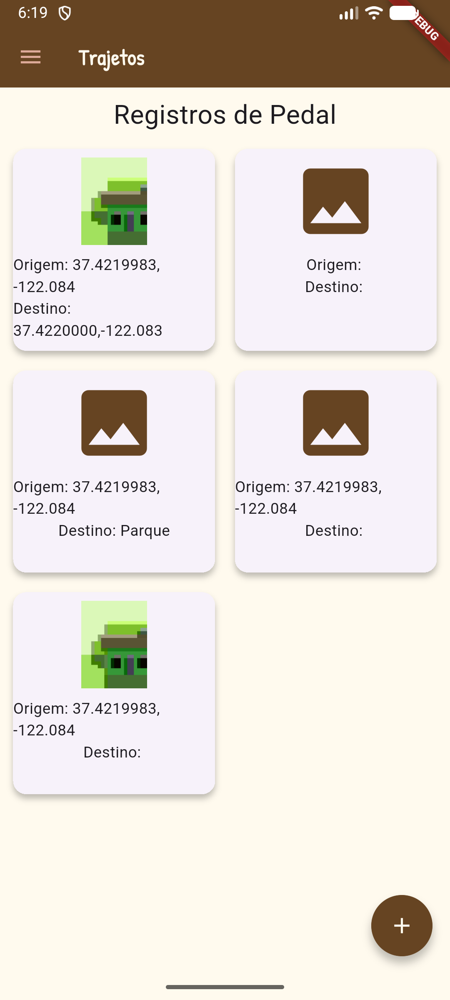

# App Pedal GPS

App Flutter para registrar passeios de bicicleta. O aplicativo permite registrar localização, imagem e informações sobre cada pedal.
- Objetivo educacional, aprendizado de flutter, geolocalização e armazenamento de dados.

## Tecnologias Utilizadas
- Flutter
- VsCode
- Android Studio

## Como testar
1. Clone o repositório para sua máquina local.
2. Abra o projeto no VsCode ou Android Studio.
3. Execute o comando `flutter pub get` para instalar as dependências.
4. Conecte um dispositivo Android ou inicie um emulador.
5. Execute o comando `flutter run` para iniciar o aplicativo.

## Screenshot
|Splash|Home Carregando|Home Ok|
|:-:|:-:|:-:|
||||
|Menu|Novo Trajeto|Camera|
||||
|Trajetos|||
||||
## [Link do APK para instalar no celular](./assets/app-release.apk)
Não me responsabilizo por qualquer dano que possa ocorrer ao instalar o aplicativo em seu dispositivo. Use por sua conta e risco.
- Se você for aluno do SESI ou SENAI utilize um celular de teste da instituição, pois o aplicativo não foi testado em todos os modelos de celulares.